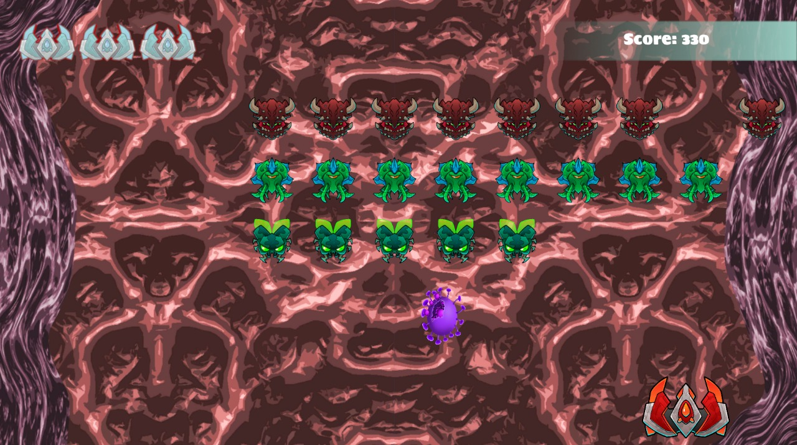
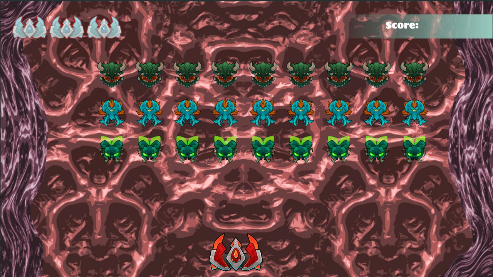
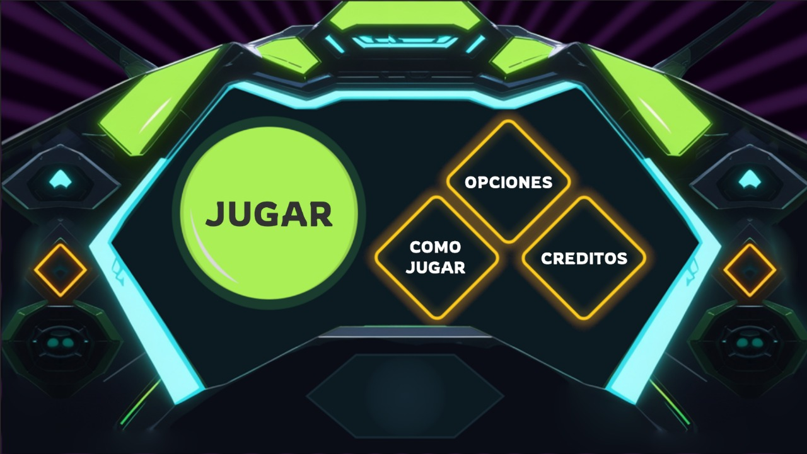
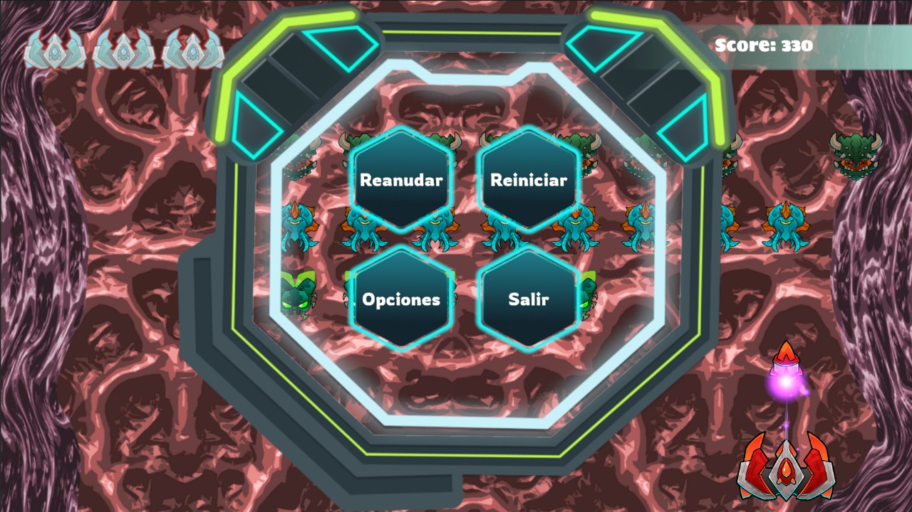
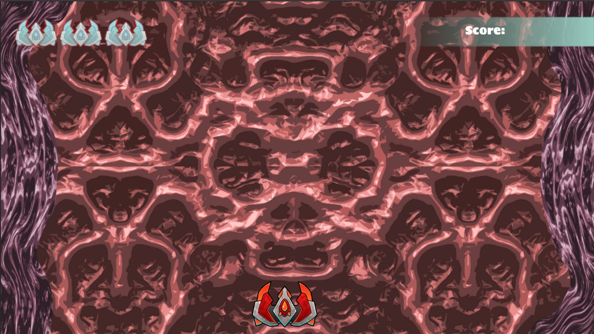
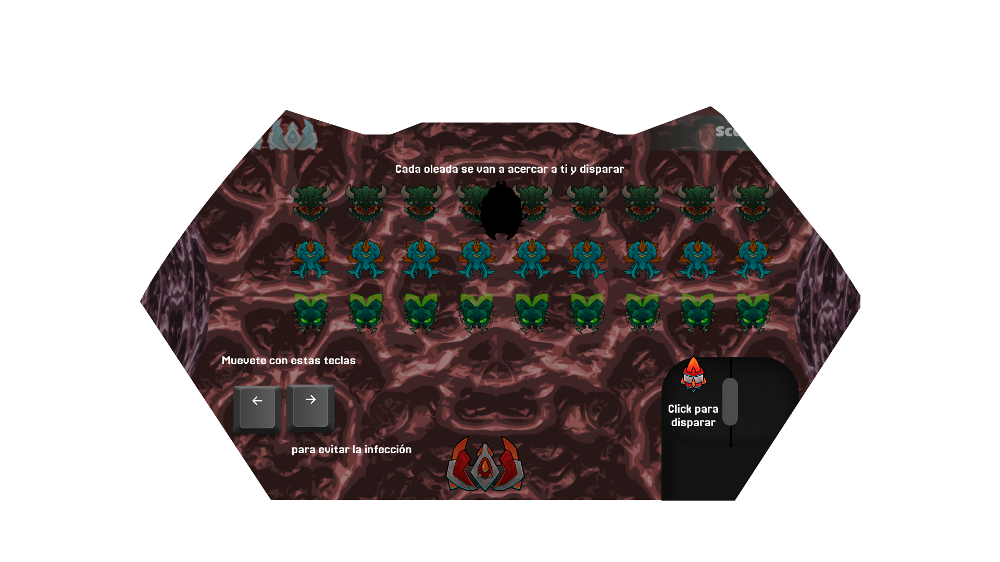
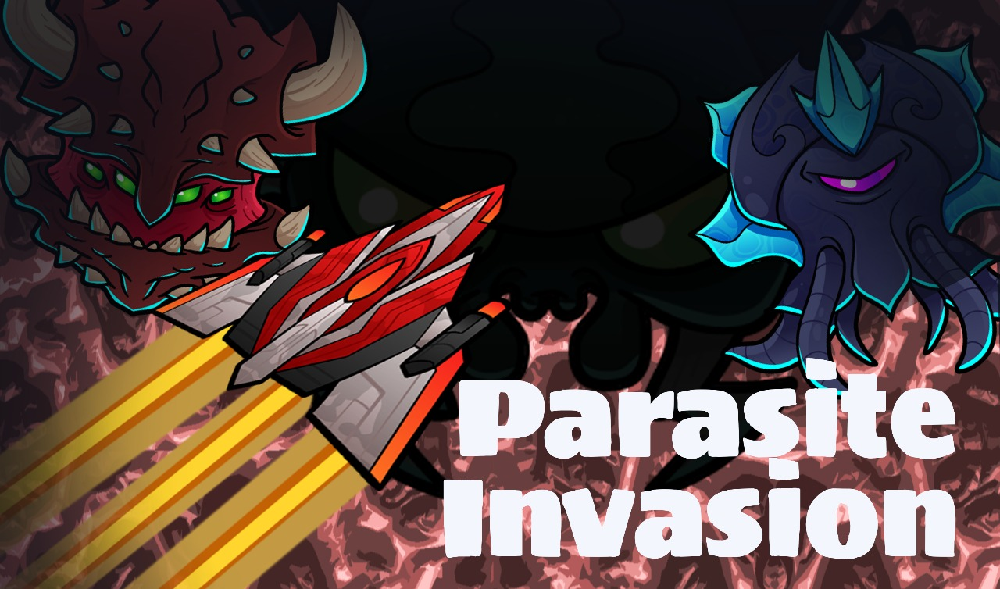
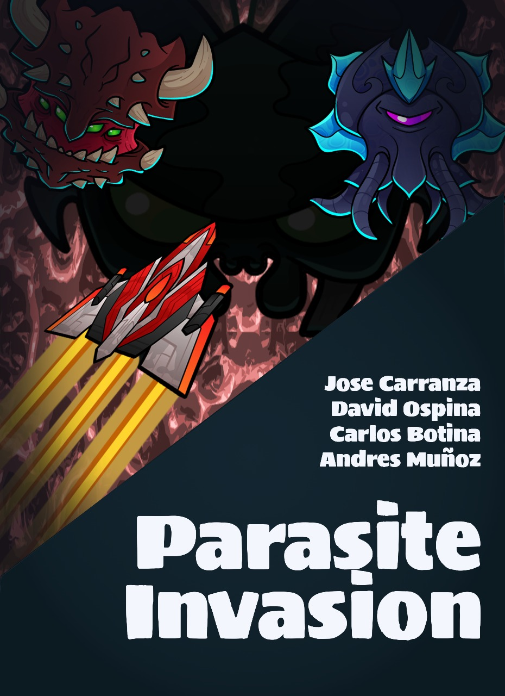
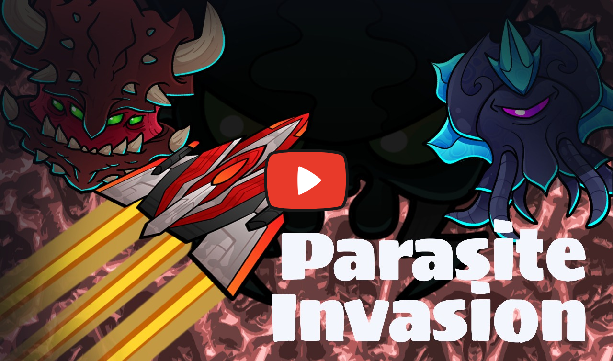

# Game Jam N° 1 - Theme "Parasite"

Desarrollo de la Game Jam N° 1, esta fue realizada en el Bootcamp de Unity en Generation Colombia con el lema de "Parasites"

# 👾🦠 PARASITE INVASION 👾🦠

## 🛡️ Género: Shooter 2D

## 👽 Escenario: El cuerpo humano

## 🧫 Objetivo: Sobrevivir y erradicar la infección

---

## 🎯 HISTORIA

Te encuentras dentro del cuerpo humano pilotando una nave de élite diseñada para erradicar virus y parásitos. Sin embargo, una amenaza se avecina: oleadas de microorganismos hostiles han invadido el sistema, disparando proyectiles infecciosos que drenan la vida del organismo.

Tú, como piloto, eres la última defensa. Tu misión es clara: esquivar, atacar y sobrevivir.

---

## 🧀 ENEMIGOS

Los parásitos que intentan apoderarse del cuerpo son:

- **Giardia** 🐉: Se mueve rápidamente en enjambres.
- **Anemia Tricurida** 🧫: Lanza proyectiles infecciosos a distancia.

Cada uno de estos enemigos tiene patrones de ataque distintos, lo que hace que la supervivencia sea un desafío constante.

---

## 🔄 MECÁNICAS DE JUEGO

- 💪 **Defiéndete**: Muévete rápidamente para esquivar los ataques enemigos.
- 🔫 **Dispara**: Usa tu nave para eliminar las oleadas de parásitos.
- 🌟 **Recupera vida**: Consigue Power-Ups que caen desde arriba y colisiónalos para restaurar tu salud.

---

## 🎮 CONTROLES

- ▶️ **Movimiento**: Usa `A` y `D` para moverte de izquierda a derecha.
- 🎯 **Disparo**: Haz clic derecho o usa el botón de disparo en los controles adicionales.

🔥 **¡MUÉVETE Y SOBREVIVE A LA INVASIÓN PARASITARIA!** 🔥

---

## 🌟 SCREENSHOTS DEL JUEGO

| 🎮 Juego | 🦠 Enemigos y Jugador | 🎨 Interfaz |
|------------|------------|------------|
|  |  |  |

| ⏸️ Pantalla de Pausa | 🚀 Jugador | 📜 Tutorial |
|------------|------------|------------|
|  |  |  |

| 🎬 Portada | 🎭 Créditos |
|------------|------------|
|  |  |

---

## 🎥 VIDEO DEL GAMEPLAY  

---

## 🎮 JUGAR EN ITCH.IO

---
## 🎨 ASSETS

- 🛸 **“Free Stylized 2D Space Shooter Pack”** by Larzes  
  🛋️ Unity Asset Store: [🔗 Enlace]()

- 🌌 **Alien Floor by Langvv**  
  📦 Unity Asset Store: [🔗 Enlace](https://assetstore.unity.com/packages/2d/textures-materials/alien-floor-6023)

- 🔥 **Free Quick Effects Vol. 1 by Gabriel Aguiar Prod**  
  📦 Unity Asset Store: [🔗 Enlace](https://assetstore.unity.com/packages/vfx/particles/free-quick-effects-vol-1-304424)

---

## 🎵 ASSET AUDIO

- 🔊 **Player Damaged Sound** [🔗 Enlace]()
- 🔊 **Enemy Shoot Sound** [🔗 Enlace]()
- 🔊 **Heal Sound** [🔗 Enlace]()
- 🔊 **Player Explosion Sound** [🔗 Enlace]()
- 🔊 **Player Shoot Sound** [🔗 Enlace]()
- 🔊 **Game Over Music** [🔗 Enlace]()
- 🔊 **Enemy Explosion Sound** [🔗 Enlace]()
- 🎶 **Soundtrack** [🔗 Enlace]()
- 🔊 **Button Sound** [🔗 Enlace]()

---

## 👥 CRÉDITOS

👨‍💻 José Carranza / Mechanics Programmer

👨‍💻 David Ospina /Audio Programer

👨‍💻 Carlos Botina /Enemy Behavior Programmer

👨‍💻 Andrés Muñoz / UI/UX Design / Programmer

